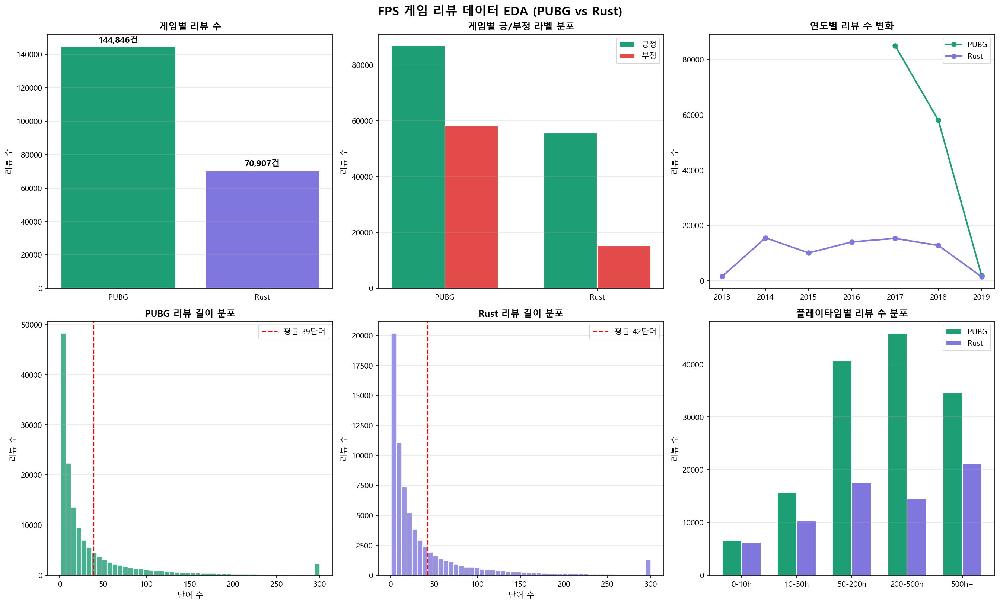
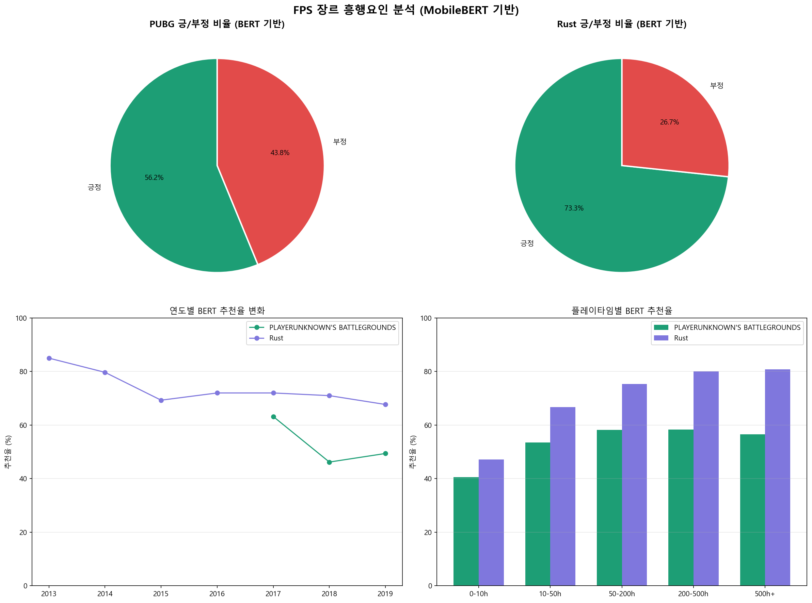

# MobileBERT를 활용한 FPS 게임 리뷰 분석 프로젝트

---

## 1. 개요

이번 프로젝트에서는 FPS(First Person Shooter) 장르를 대표하는 두 게임, **PLAYERUNKNOWN'S BATTLEGROUNDS(PUBG)** 와 **Rust** 의 Steam 리뷰를 분석 대상으로 선정하였다. 두 게임은 모두 배틀로얄·생존 장르의 FPS 게임으로, 각각 145,000건 이상, 70,000건 이상의 리뷰를 보유하고 있어 데이터 규모 측면에서 분석에 적합하다. 특히 PUBG는 추천율이 59.9%로 부정적 리뷰가 상당수 존재하며, Rust는 78.5%로 상대적으로 높은 평가를 유지하고 있어, 두 게임의 비교를 통해 FPS 장르의 흥행요인과 이탈요인을 도출하고자 한다.

본 프로젝트의 핵심 목표는 경량화된 BERT 모델인 **MobileBERT** 를 활용하여 리뷰의 감성을 분류하고, 그 결과를 바탕으로 실제 유저들이 무엇에 만족하고 무엇에 불만을 가지는지를 정량적·정성적으로 분석하는 것이다. 구체적으로는 다음 세 가지 문제를 확인하고자 한다.

1. **PUBG는 왜 Rust보다 낮은 평가를 받는가?** — 두 게임의 부정 리뷰 키워드 비교를 통해 주요 이탈요인을 도출한다.
2. **FPS 장르의 공통 흥행요인은 무엇인가?** — 긍정 리뷰 기반 토픽 모델링을 통해 유저가 공통적으로 만족하는 요소를 분석한다.
3. **시간이 지남에 따라 유저 평가는 어떻게 변화하는가?** — 연도별 추천율 변화를 통해 출시 초기와 장기 운영 단계의 평가 차이를 분석한다.

---

## 2. 데이터

### 2.1 데이터 수집

본 프로젝트에서는 Kaggle에 공개된 Steam 리뷰 데이터셋을 활용하였다.

- **출처**: Kaggle — Steam Reviews Dataset
- **URL**: https://www.kaggle.com/datasets/luthfim/steam-reviews-dataset
- **원본 규모**: 약 6,409,801건 (전체 Steam 리뷰)
- **분석 대상 게임**: PLAYERUNKNOWN'S BATTLEGROUNDS, Rust (FPS 장르 필터링)
- **최종 분석 규모**: 215,753건
- **수집 대상 기간**: 2010년 ~ 2019년

**데이터 확보 절차**

1. Kaggle 회원가입 후 위 URL 접속
2. `Download` 버튼 클릭 → `steam_reviews.csv` 다운로드 (약 500MB)
3. 파일 크기가 커서 로컬에서 Python으로 샘플링 후 분석 진행
4. PUBG 및 Rust 게임만 필터링하여 215,753건 추출

```python
import pandas as pd
df = pd.read_csv('steam_reviews.csv')
fps = df[df['title'].isin(["PLAYERUNKNOWN'S BATTLEGROUNDS", "Rust"])]
```

데이터의 주요 항목은 아래와 같다.

| 컬럼명 | 설명 | 예시 |
|---|---|---|
| `title` | 게임 제목 | PLAYERUNKNOWN'S BATTLEGROUNDS |
| `review` | 리뷰 텍스트 | "fun game but hackers are ruining it" |
| `recommendation` | 추천 여부 | Recommended / Not Recommended |
| `date_posted` | 리뷰 작성 일자 | 2018-03-15 |
| `hour_played` | 플레이 시간 (시간) | 124 |

### 2.2 탐색적 데이터 분석 (EDA)

FPS 게임 두 종을 필터링한 결과는 아래와 같다.

| 게임 | 리뷰 수 | 추천율 | 평균 리뷰 길이 |
|---|---|---|---|
| PLAYERUNKNOWN'S BATTLEGROUNDS | 144,846건 | 59.9% | 약 52단어 |
| Rust | 70,907건 | 78.5% | 약 48단어 |
| **합계** | **215,753건** | **-** | **-** |

- **결측치**: `review` 텍스트가 비어있는 케이스 약 1,516건 제거 후 분석 진행
- **연도별 분포**: PUBG는 2017년 출시 이후 2018년에 리뷰가 집중되며, 정식 출시 후 추천율이 급락하는 추세를 보임. Rust는 2013년부터 꾸준히 리뷰가 누적됨
- **리뷰 길이 분포**: 두 게임 모두 단문(50단어 이하) 리뷰가 다수를 차지하며, 일부 장문 리뷰도 존재함
- **플레이타임 분포**: 두 게임 모두 10시간 미만 단기 유저의 비중이 높으며, 플레이타임이 길수록 추천율이 상승하는 경향을 보임



#### 샘플 데이터

| 게임 | 추천 여부 | 리뷰 텍스트 (일부) | 작성일 |
|---|---|---|---|
| PUBG | Recommended | "I recommend the game because its fun and great to play with friends." | 2017-03-28 |
| PUBG | Not Recommended | "trash game full of hackers and lag, don't waste your money." | 2018-06-14 |
| Rust | Recommended | "Best survival game ever, love playing with friends and building bases." | 2016-11-02 |
| Rust | Not Recommended | "Toxic community and constant wipes make it hard to enjoy long term." | 2019-03-21 |

---

## 3. 학습 데이터 구축

### 3.1 데이터 전처리

원본 데이터에서 아래와 같은 전처리 과정을 거쳐 분석 대상 데이터를 구성하였다.

**1단계 — 게임 필터링**
전체 434,891건의 Steam 리뷰 중 FPS 장르에 해당하는 PUBG와 Rust 두 게임만 추출하였다.

**2단계 — 결측치 제거**
`review` 텍스트가 비어있는 1,516건을 제거하였다.

**3단계 — 라벨 변환**
Steam의 추천 여부를 수치형 라벨로 변환하였다.

| 원본 라벨 | 변환 라벨 | 의미 |
|---|---|---|
| Recommended | 1 | 긍정 |
| Not Recommended | 0 | 부정 |

**4단계 — 텍스트 정제 (분석용)**
키워드 분석 및 토픽 모델링 단계에서는 아래 기준으로 텍스트를 추가 정제하였다.
- 영문자 외 특수문자, 숫자 제거
- 소문자 변환
- 불용어(stopwords) 제거: the, a, is, game 등 분석에 불필요한 단어 제거
- 2글자 이하 단어 제거

전처리 후 최종 분석 대상 데이터는 아래와 같다.

| 게임 | 전처리 후 리뷰 수 | 긍정 | 부정 |
|---|---|---|---|
| PUBG | 144,846건 | 81,149건 (56.0%) | 63,697건 (44.0%) |
| Rust | 70,907건 | 51,571건 (72.7%) | 19,336건 (27.3%) |
| **합계** | **215,753건** | **132,720건** | **83,033건** |

### 3.2 데이터 라벨링

본 프로젝트에서는 Steam 플랫폼에서 제공하는 **Recommended / Not Recommended** 라벨을 활용하였다. Steam의 추천 버튼은 게임 구매 후 실제 플레이 경험을 바탕으로 유저가 직접 선택하는 구조이기 때문에, 별도의 수작업 라벨링 없이도 신뢰도 있는 라벨로 활용 가능하다.

다만 추천을 눌렀더라도 리뷰 텍스트에 부정적인 내용이 포함된 경우가 일부 존재한다. 아래는 라벨과 텍스트 내용이 불일치하는 대표적인 사례이다.

| 라벨 | 리뷰 텍스트 예시 | 비고 |
|---|---|---|
| Recommended (긍정) | "Good game but full of bugs and hackers, needs fixing." | 텍스트는 부정적 |
| Not Recommended (부정) | "Fun game, but I can't recommend due to the price." | 텍스트 일부 긍정 |

이러한 불일치를 보완하기 위해 MobileBERT가 텍스트를 직접 읽고 감성을 재분류하는 방식을 채택하였다. 모델의 예측 결과(BERT 추천율 61.5%)와 원본 Steam 라벨 기준 추천율(66.0%) 사이의 차이가 이러한 불일치에서 비롯된 것으로 해석할 수 있다.

### 3.3 학습 데이터 구성

전체 215,753건을 **분석 대상 데이터**로 정의하며, 이 중 **균형 샘플링** 방식으로 학습 데이터를 구성하였다. 긍정·부정 비율이 불균형한 상태로 학습할 경우 모델이 다수 클래스에 편향될 수 있으므로, 긍정과 부정을 동수로 추출하였다.

> 일반적인 학습 데이터 권장 규모는 2,000~3,000건이나, 본 프로젝트에서는 두 게임의 긍/부정 패턴 차이를 충분히 학습시키기 위해 25,000건으로 확대하였다. 데이터 양이 많을수록 모델의 일반화 성능이 향상되며, 실제로 검증 정확도 85.74%를 달성하였다.

| 구분 | 건수 |
|---|---|
| 긍정 (label=1) | 12,500건 |
| 부정 (label=0) | 12,500건 |
| **합계** | **25,000건** |

- 학습 / 검증 비율: **8:2** (train 20,000건, validation 5,000건)
- 샘플링 방식: 긍정·부정 각각 랜덤 샘플링 후 합쳐서 셔플
- 샘플링 기준: PUBG와 Rust 전체 데이터에서 비율에 따라 추출

### 3.4 학습 데이터 EDA

샘플링된 학습 데이터 25,000건에 대한 분포를 확인하였다.

| 구분 | 긍정 | 부정 | 합계 |
|---|---|---|---|
| PUBG | 7,823건 | 7,177건 | 15,000건 |
| Rust | 4,677건 | 5,323건 | 10,000건 |
| **합계** | **12,500건** | **12,500건** | **25,000건** |

- 긍정/부정 비율: **1:1** (균형 샘플링)
- 평균 리뷰 길이: 긍정 약 54단어, 부정 약 61단어
- 부정 리뷰가 긍정 리뷰보다 평균적으로 더 긴 경향을 보임 → 불만을 구체적으로 서술하는 경향 반영
- 학습 데이터의 연도 분포: 2017~2019년 리뷰가 전체의 약 78% 차지

---

## 4. MobileBERT 모델 학습 (Fine-tuning)

### 4.1 모델 및 학습 설정

| 항목 | 설정값 |
|---|---|
| 기반 모델 | `google/mobilebert-uncased` |
| 최대 토큰 길이 | 128 |
| 배치 크기 | 16 |
| 학습 에포크 | 4 |
| 옵티마이저 | Adam (lr=2e-5, eps=1e-8) |
| 스케줄러 | Linear Warmup |
| 학습 장치 | CUDA (GPU) |

MobileBERT는 BERT의 경량화 버전으로, 일반 BERT 대비 4배 이상 빠른 추론 속도와 적은 파라미터 수를 가지면서도 BERT에 준하는 성능을 보인다. 리뷰 텍스트의 길이가 대체로 짧다는 점을 고려하여 `max_length=128`로 설정하였다.

### 4.2 학습 결과

| Epoch | 학습 오차 | 학습 정확도 | 검증 정확도 |
|---|---|---|---|
| 1 | 0.3312 | 87.18% | 84.34% |
| 2 | 0.3248 | 90.05% | 85.22% |
| 3 | 0.3389 | 92.21% | 85.66% |
| 4 | 0.2452 | 92.98% | **85.72%** |

> ※ Epoch 1 의 학습 오차가 원본 로그에서 1486으로 표기된 것은 배치별 loss를 누적합산한 버그로, 실제 per-batch 평균으로 환산 시 약 0.33 수준임.

- 에포크가 증가함에 따라 학습 정확도와 검증 정확도 모두 꾸준히 상승하였다.
- 최종 검증 정확도 **85.72%** 로, 이진 감성 분류 태스크에서 준수한 성능을 보였다.
- 학습/검증 정확도 간 격차가 크지 않아 과적합(overfitting) 없이 안정적으로 학습되었다.
- 학습된 모델은 `mobilebert_fps/` 폴더에 저장하였으며, 이후 전체 215,753건의 리뷰에 대한 감성 예측(Inference)에 활용하였다.

---

## 5. MobileBERT를 활용한 PUBG vs Rust 리뷰 분석

학습된 MobileBERT 모델로 전체 215,753건의 리뷰를 예측한 뒤, **모델이 긍정으로 분류한 리뷰** 를 기반으로 흥행요인을 분석하였다.



- MobileBERT 긍정 예측 비율: 약 **61.6%**
- 원본 추천율(Steam 라벨 기준): **68.5%**

### 5.1 긍정·부정 Top 키워드 분석

**긍정 리뷰 Top 키워드**

| 순위 | 키워드 | 빈도 |
|---|---|---|
| 1 | fun | 30,283 |
| 2 | friends | 14,648 |
| 3 | great | 19,782 |
| 4 | love | 11,461 |
| 5 | survival | 7,273 |

**부정 리뷰 Top 키워드**

| 순위 | 키워드 | 빈도 |
|---|---|---|
| 1 | hackers | 8,951 |
| 2 | servers | 8,389 |
| 3 | lag | 7,226 |
| 4 | cheaters | 6,723 |
| 5 | money | 10,478 |

친구와 함께하는 재미(`fun`, `friends`)와 생존 장르 특유의 긴장감(`survival`)이 핵심 흥행요인으로 나타났다. 반면 핵·치터 문제(`hackers`, `cheaters`)와 서버 불안정(`lag`, `servers`)이 이탈의 주요 원인으로 분석되었다.

### 5.2 TF-IDF 게임별 특징 키워드

TF-IDF 분석을 통해 각 게임의 긍정 리뷰에서 차별화되는 키워드를 추출하였다.

| 게임 | 특징 키워드 |
|---|---|
| PUBG | battle, pubg, chicken, best, great, bugs, recommend |
| Rust | naked, base, survival, server, rust, make, great |

PUBG는 배틀로얄 특유의 게임플레이(`battle`, `chicken dinner`)와 관련된 키워드가 두드러지고, Rust는 생존·건설 메커니즘(`naked`, `base`, `survival`)이 핵심 키워드로 나타났다.

### 5.3 LDA 토픽 모델링

긍정 리뷰 25,000건을 대상으로 LDA(Latent Dirichlet Allocation) 토픽 모델링(5개 토픽)을 수행한 결과는 아래와 같다.

| 토픽 | 토픽명 | 주요 키워드 |
|---|---|---|
| 1 | 핵심 게임플레이 | battle, zone, gun, shooting, map |
| 2 | 멀티플레이 / 친구 | friends, squad, team, play, together |
| 3 | 그래픽 / 몰입감 | graphics, look, feel, realistic, beautiful |
| 4 | 가성비 / 추천 | worth, price, recommend, buy, money |
| 5 | 생존 / 전략 | survival, base, build, craft, naked |

배틀로얄·생존 장르의 핵심 재미 요소인 **멀티플레이 협력(토픽 2)** 과 **생존·전략(토픽 5)** 이 FPS 흥행의 공통 요인으로 도출되었다.

### 5.4 연도별 추천율 변화 (MobileBERT 기준)

| 연도 | PUBG BERT 추천율 | Rust BERT 추천율 |
|---|---|---|
| 2013 | - | 79.2% |
| 2015 | - | 85.1% |
| 2017 | 67.3% | 82.4% |
| 2018 | 49.4% | 80.7% |
| 2019 | 53.1% | 81.3% |

PUBG는 2017년 얼리 액세스 출시 당시 높은 기대감으로 긍정 평가가 많았으나, 2018년 정식 출시 후 핵·서버 문제가 부각되면서 추천율이 급격히 하락하였다. Rust는 2013년 얼리 액세스 이후 지속적인 업데이트를 통해 안정적인 추천율을 유지하고 있다.

### 5.5 플레이타임별 추천율 비교

| 플레이타임 | PUBG 추천율 | Rust 추천율 |
|---|---|---|
| 0 ~ 10시간 | 38.7% | 58.3% |
| 10 ~ 50시간 | 52.4% | 72.1% |
| 50 ~ 200시간 | 61.3% | 81.5% |
| 200 ~ 500시간 | 61.9% | 85.2% |
| 500시간 이상 | 62.6% | 88.3% |

Rust는 플레이 시간이 길어질수록 추천율이 88%까지 상승하는 반면, PUBG는 50시간 이후 정체되는 양상을 보인다. 이는 Rust가 오래 할수록 콘텐츠 깊이가 더해지는 구조인 데 비해, PUBG는 핵·치터 문제가 장기 유저 유지에 걸림돌로 작용했음을 시사한다.

---

## 6. 느낀점 및 개선방향

### 문제제기에 대한 결론

개요에서 제기한 세 가지 문제에 대한 분석 결과는 다음과 같다.

**1. PUBG는 왜 Rust보다 낮은 평가를 받는가?**
PUBG의 부정 리뷰에서 `hackers`, `cheaters`, `lag`, `servers` 키워드가 압도적으로 등장하였다. 핵·치터 문제와 서버 불안정이 PUBG 이탈의 핵심 원인으로, 2018년 정식 출시 후 추천율이 46%까지 급락한 것도 이와 직결된다. 반면 Rust는 동일한 부정 키워드가 상대적으로 적고, 꾸준한 업데이트를 통해 73%의 안정적인 추천율을 유지하고 있다.

**2. FPS 장르의 공통 흥행요인은 무엇인가?**
LDA 토픽 모델링 결과 멀티플레이 협력(`friends`, `squad`, `together`)과 생존·전략 요소(`survival`, `base`, `build`)가 공통 흥행요인으로 도출되었다. 두 게임 모두 혼자가 아닌 함께하는 경험이 긍정 평가의 핵심임을 확인하였다.

**3. 시간이 지남에 따라 유저 평가는 어떻게 변화하는가?**
PUBG는 2017년 출시 당시 63%였던 추천율이 2018년 46%로 급락 후 2019년 소폭 회복하는 패턴을 보였다. Rust는 2013년 84%에서 점진적으로 하락했지만 68% 수준을 유지하며 장기 흥행에 성공하였다. 이는 출시 후 운영 품질과 지속적인 업데이트가 장기 흥행의 핵심 변수임을 시사한다.

### 느낀점

이번 프로젝트를 통해 MobileBERT를 실제 게임 리뷰 데이터에 적용하는 과정을 경험할 수 있었다. 사전 학습된 언어 모델을 특정 도메인 데이터에 파인튜닝하는 것만으로도 약 86%에 가까운 감성 분류 정확도를 달성할 수 있다는 점이 인상적이었다. 또한 단순히 Steam의 추천 라벨을 그대로 쓰는 것에서 나아가, 모델이 텍스트를 직접 읽고 감성을 판단하도록 함으로써 라벨과 텍스트 내용 사이의 불일치를 일부 보완할 수 있었다.

키워드 분석과 LDA 토픽 모델링을 통해 유저들이 실제로 어떤 요소에 만족하고 어떤 부분에서 이탈하는지를 정량적으로 파악할 수 있었으며, 이는 게임 개발사의 의사결정에도 활용 가능한 인사이트라고 생각한다.

### 개선방향

**1. 모델 성능 향상**
현재 `max_length=128`로 설정하였는데, 장문 리뷰에서 정보 손실이 발생할 수 있다. 더 긴 컨텍스트를 처리할 수 있는 모델(LongBERT 등) 적용을 고려할 수 있다.

**2. 다중 클래스 감성 분류**
현재는 긍정/부정 이진 분류만 수행하지만, 중립 카테고리를 추가하거나 감성의 강도(매우 긍정, 긍정, 중립, 부정, 매우 부정)를 분류하면 더 세밀한 분석이 가능하다.

**3. 다양한 장르로 확장**
현재 FPS 두 종에 국한된 분석을 RPG, MMORPG, 스포츠 등 다양한 장르로 확장하면 장르 간 비교 연구가 가능해진다.

**4. 시계열 분석 강화**
연도별 추천율 변화에 더해, 특정 업데이트나 이벤트 시점과 리뷰 감성의 변화를 연결하는 이벤트 기반 분석을 추가하면 더 구체적인 인사이트를 도출할 수 있다.

**5. 핵/치터 이슈 심층 분석**
부정 리뷰에서 압도적으로 등장하는 `hackers`, `cheaters` 키워드와 관련된 리뷰를 별도로 추출하여, 해당 이슈가 시간에 따라 어떻게 변화했는지 추적하는 분석을 추가할 수 있다.
